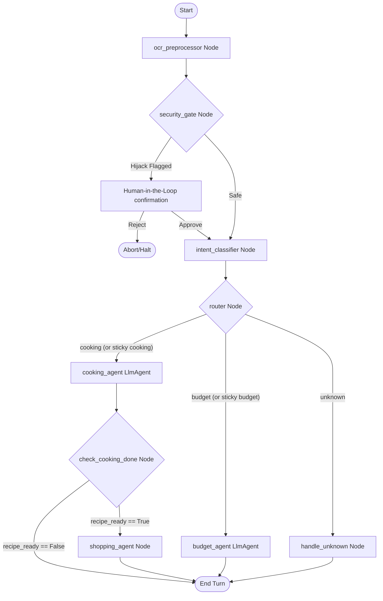

# BiteBudget: Smart Cooking & Grocery Shopping Assistant


An intelligent, secure, and budget-conscious personal assistant built using the **Google Agent Development Kit (ADK)** and the **Gemini Developer API**. 

---

## 📌 Problem Statement

Managing household meals and grocery expenses is a highly fractured process:
1.  **Context Disconnect:** Users browse recipe ideas online but have to manually type out ingredients to create grocery lists.
2.  **Financial Disconnect:** Users buy groceries without a clear understanding of what they spent or what items actually cost over time.
3.  **Lack of Spending Insights:** It is hard to analyze past buying habits (e.g., comparing how much meat was purchased in the last month versus vegetables) to make healthier or more cost-effective choices.
4.  **Manual Friction:** Keeping a budget requires tedious manual input of items and prices from physical receipts.
5.  **Security Risks:** Modern assistants are vulnerable to malicious prompt injection or accidental exposure of Personally Identifiable Information (PII).

---

## 💡 The Solution

**BiteBudget** is a session-sticky assistant that bridges the gap between meal planning and budget management:
*   **Cooking Workflow:** Recommends recipes, parses ingredients from URLs, decodes pictures of meals (from restaurants or the web) into recipes, and automatically generates a markdown checklist (`shopping_list.md`) when a recipe is finalized.
*   **Budget & Expense Workflow:** Records actual purchases (via text or **Receipt OCR** with prices), queries spending histories, details spending habits (e.g., tracking meat vs. vegetable costs), and writes logs to a local JSON database (`shopping_history.json`).
*   **Active Security Gate:** Analyzes inputs for prompt injection and jailbreak overrides with a Human-in-the-Loop gate (`RequestInput`), and redacts PII (emails, cards, phones) using regex preprocessors.
*   **Vibe-Coded React Frontend:** Renders a gorgeous, responsive, vibe-coded split-panel interface with real-time checkbox syncing, dashboard metrics, and a retro-neon styling theme.

---

## 🏗️ System Architecture & Workflow

The application uses an agentic state-machine graph built via the ADK Workflow framework:



### State Schema (`WorkflowState`)
*   `active_agent`: Enforces session stickiness to maintain active cooking or budget branches.
*   `recipe_ready`: Flipped to `True` when a recipe is finalized.
*   `recipe_name`, `recipe_ingredients`, `recipe_quantities`: Stores finalized recipe data.
*   `user_query`: Preprocessed and redacted user input string.

---

## 🚀 Setup & Execution Guide

### Prerequisites
*   [uv](https://docs.astral.sh/uv/) (Python package and environment manager)
*   Google Agents CLI (install via `uv tool install google-agents-cli`)

### 1. Install Dependencies
Initialize Python environments and download packages:
```bash
agents-cli install
```

### 2. Configure API Key
Export your Gemini API Key in your terminal session:
```bash
export GEMINI_API_KEY="your-api-key"
```

### 3. Run Automated Tests
Execute the unit and E2E integration test suites:
```bash
uv run pytest tests/unit tests/integration
```

### 4. Start the Sandbox & UI
Start the local FastAPI backend and Vite dev frontend proxy concurrently:
```bash
agents-cli playground
```
Once started, open the local URL in your browser to interact with the web interface.

### 5. Launch the ADK Web UI Debugger
To visually trace node executions, inspect tool calls, and monitor state variables step-by-step:
```bash
uv run adk web ./app
```
Open the generated link in your browser to debug the agentic workflow.

---

## 📂 Project Structure

```
cooking-shopping-assistant/
├── app/                      # Core agent codebase
│   ├── agent.py              # Workflow graph, nodes, and router configurations
│   ├── tools.py              # Agent tools (record_purchase, finish_recipe, etc.)
│   ├── ocr.py                # Image text extraction via Gemini Vision
│   ├── fast_api_app.py       # FastAPI backend server
│   └── app_utils/            # Logging, typing, and telemetry setup
├── frontend/                 # React frontend client
│   ├── src/                  # React components, stylesheet, and main entrypoints
│   ├── package.json          # Node dependencies
│   └── vite.config.ts        # Vite dev-server config
├── tests/                    # Testing suites
│   ├── unit/                 # Unit tests (PII redaction, OCR parsing)
│   ├── integration/          # Integration/E2E API stream tests
│   └── eval/                 # Dataset evaluations and metrics
├── pyproject.toml            # Backend dependencies and tools setup
├── shopping_history.json     # Persistent database for logged expenditures
├── shopping_list.md          # Generated interactive markdown checklist
└── project_thumbnail.jpg     # Project thumbnail graphic
```
