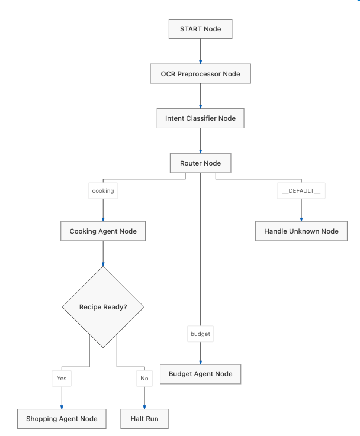

# Capstone Project Submission: Cooking & Shopping Assistant


An agentic state machine that helps you plan meals, automatically generate shopping lists, and log grocery receipts using Gemini OCR.

---

## 📌 Project Overview & Planning

### 1. Problem Statement
Managing daily meals and household expenses is a common, time-consuming challenge. People frequently face:
*   **Context Disconnect:** Finding recipes online and manually translating them into grocery checklists.
*   **Financial Disconnect:** Planning meals without knowing what has already been spent or what items actually cost.
*   **Lack of Spending Insights:** Difficulty checking statistics on past purchases—such as comparing how much meat was bought in the last month versus vegetables—to make informed nutritional and financial decisions.
*   **Manual Friction:** Having to manually type out ingredients or type out receipts item-by-item to keep a budget.
*   **Security & Safety Risks:** Modern conversational assistants are vulnerable to malicious prompt injection or accidental exposure of Personally Identifiable Information (PII).

### 2. The Solution: Cooking & Shopping Assistant
Our submission is a unified, session-sticky personal assistant that bridges the gap between planning and purchasing:
1.  **Cooking Workflow:** Recommends recipes, parses ingredients from URLs, decodes pictures of meals (from favorite restaurants or the internet) into ingredients and complete recipes via **Vision OCR**, and automatically generates a markdown checklist (`shopping_list.md`) when a recipe is finalized.
2.  **Budget & Expense Workflow:** Records actual purchases (via text descriptions from the user or **Receipt OCR** with prices), queries historical spending, details spending habits (e.g. tracking how much is spent on meat vs. veggies), and tracks grocery costs over time, ensuring data is written to a local database (represented for simplicity as a JSON file on disk `shopping_history.json`).
3.  **Active Security:** Intercepts prompt injections using an LLM-in-the-loop security gate and redacts PII before processing.
4.  **Funky, Modern Web UI:** Provides an interactive chat interface styled to look vibrant, modern, and engaging.

### 3. Track Selection
*   **Primary Category:** Congierge Agents

---

## 🏗️ System Architecture & Workflow

The core of the application is an agentic state machine designed using the **ADK Workflow** framework. 



### State Management (`WorkflowState`)
We utilize a persistent state schema subclassing Pydantic's `BaseModel`:
*   `active_agent`: Tracks the current conversation branch (`cooking` or `budget`) to maintain session stickiness.
*   `recipe_ready`: A boolean flag flipped when a recipe is finalized.
*   `recipe_name`, `recipe_ingredients`, `recipe_quantities`: Stores details of the active recipe.
*   `user_query`: Contains the sanitized, preprocessed input text.

---

## 🛠️ Key Agentic Capabilities & Implementations

### 1. Preprocessing & PII Redaction
All incoming queries pass through the `ocr_preprocessor` which extracts text from uploaded images (like recipes or receipts) and merges it with the user message. Before downstream routing, the query is scrubbed using regex patterns to redact PII:
*   **Emails** are replaced with `[REDACTED_EMAIL]`.
*   **Credit Cards** (13-19 digits, handling spaces/dashes) are replaced with `[REDACTED_CARD]`.
*   **Phone Numbers** (various formats) are replaced with `[REDACTED_PHONE]`.

### 2. LLM-Based Hijack Detection & Human-in-the-Loop
The `security_gate` uses a dedicated call to `gemini-flash-lite-latest` acting as a prompt security classifier.
*   If a prompt injection or system prompt override attempt is detected:
    1.  The workflow is **paused** using ADK's `RequestInput` interrupt.
    2.  An interactive warning is presented to the user asking: *"Do you want to proceed anyway?"*
    3.  If the user confirms `"yes"`, execution resumes. If `"no"`, execution is halted to prevent exploits.

### 3. Intent Classification & Sticky Routing
The workflow classifies user intent dynamically:
*   `cooking`: Discussing recipe ideas, asking questions, or planning ingredients.
*   `budget`: Logging confirmed purchases or querying past expenses.
*   `unknown`: General greetings or chitchat.
*   **Stickiness Rule:** To prevent jarring transitions during general chatter, the router stays locked onto the active agent (e.g. if the user is in the middle of cooking planning, saying *"that's cool"* will keep them in the cooking context instead of resetting or routing to unknown).

### 4. Downstream Agents & Tools
*   **Cooking Agent:** Equipped with:
    *   `load_web_page`: Fetches recipe content from links.
    *   `finish_recipe`: Captures recipe name, ingredients, and quantities, updating state flags.
    *   **Image Meal Decoding:** Processes uploaded images of meals (e.g. from favorite restaurants or the web) to identify dishes and generate matching recipe ingredients/instructions.
*   **Shopping Agent:** Translates the finalized state into `shopping_list.md` as a markdown checklist:
    ```markdown
    # Shopping List for Spaghetti Carbonara
    Generated on 2026-07-03 11:25:00
    - [ ] **spaghetti** (400g)
    - [ ] **pancetta** (150g)
    - [ ] **eggs** (4 large)
    ```
*   **Budget Agent:** Equipped with:
    *   `record_purchase`: Appends itemized name, price, and quantity records into `shopping_history.json`.
    *   `get_shopping_history`: Retrieves past transaction JSON arrays to perform analytics (total expenditure, item trends, average grocery bill).
    *   **Financial Guardrail:** The agent is instructed *never* to log a purchase as $0 or assume items were bought unless the user explicitly confirms they purchased them (e.g., uploading a receipt or saying *"I bought these"*).

---

## 🎨 System Build & UI Implementation

The application is structured as a decoupled web application containing a Python FastAPI backend and a React TypeScript frontend, both designed to run in a developer's local environment.

### ⚙️ Terminal-Driven Process Launch
The backend and frontend are designed to be spun up dynamically from the terminal:
*   **FastAPI Backend Server:** Handles the state machine execution, routes incoming message payloads, and provides API endpoints for data storage (`shopping_history.json` and `shopping_list.md`).
*   **Vite Dev Server (Frontend):** Serves the interactive user interface and proxies API requests back to the local backend.
*   **Single-Command Workspace:** By executing `agents-cli playground` in the project root, the system initiates both servers concurrently, setting up the local proxy automatically.

### ⚛️ Vibe-Coded React Frontend
The user interface was built using **React, TypeScript, and Vite**. Following the vibe-coding paradigm:
*   We specified structural requirements (dual-pane layout split between a chat interface and persistent markdown checkbox sync/dashboard) and let the AI generate the TSX and CSS implementation.
*   The UI includes inline receipt uploads, active security gate interrupt banners, bi-directional checkbox click listeners that write updates back to the local markdown file, and structured feedback rating widgets.

### 🌟 Design & Aesthetic (Enforced via Antigravity Agent Skill)
The design theme was governed by the project's global customization skill `funky-modern-ui`:
*   **Palette:** Warm, deep indigos (`#151226`) for text, electric lavender (`#7a66f4`) and coral pink (`#fe5f55`) for buttons, and bright mint (`#37db9c`) for confirmation flags (avoiding harsh blacks or boring enterprise grays).
*   **Typography:** Google Fonts (`Outfit` for readable body text and `Comfortaa` for rounded headings and brand logo).
*   **Tactility:** Translucent glassmorphism containers (`backdrop-filter`) paired with generous rounding (`border-radius: 50px` for buttons) and fluid scale/transform micro-animations on hover states make the application feel highly interactive and premium.

---

## 📈 Evaluation & Testing Methodology

We enforced reliability through a thorough testing hierarchy:

1.  **Unit Tests:** Verifies core utility functions like OCR parsing, regex PII redaction, and state schema compliance.
2.  **Integration & E2E Tests:** Launches the FastAPI server in a subprocess and runs simulated HTTP request streams (SSE) to test full-turn conversations.
3.  **Prompt & Workflow Evaluations (`agents-cli eval`):**
    *   Configured custom LLM-as-a-judge metrics in [eval_config.yaml](file:///Users/cristina/Desktop/kaggle_vibe_coding/cooking_shopping_capstone_project/cooking-shopping-assistant/tests/eval/eval_config.yaml).
    *   `custom_response_quality`: Grades the output from 1 to 5 based on relevance, accuracy, and structure.
    *   `agent_turn_count`: Evaluates conversation turn efficiency.
    *   We continuously iterated on system instructions to minimize false positives/negatives in intent classification.

---

## 🏆 Key Course Concepts Rubric Alignment

To demonstrate our application's design, we align directly with the six key concepts and their required demonstration channels:

### 1. Agent / Multi-agent system (ADK) [Demonstrated in Code]
*   **Implementation:** Built using the Google Agent Development Kit (ADK) workflow module (`google.adk.workflow`). The orchestration is designed as a state-machine graph (`Workflow`) utilizing a persistent `WorkflowState` schema.
*   **Sub-Agent Collaboration:** Integrates two distinct, specialized `LlmAgent` sub-agents (`cooking_agent` and `budget_agent`) with separate instructions and tools, sharing contextual session states dynamically.
*   **OCR Integration Agents:** Implements an OCR preprocessor agent node (`ocr_preprocessor`) that detects uploaded images (e.g. recipe cards or grocery receipts) and utilizes Gemini to extract structured text contents, feeding them back into the shared workflow state automatically.

### 2. MCP Server [Demonstrated in Code]
*   **Development-Time MCP Integration:** During the development cycle, the workspace integrated with lazy-loaded Model Context Protocol (MCP) servers:
    *   *github MCP Server:* Used to initialize the repository, commit files, and push code changes.
    *   *google-developer-knowledge MCP Server:* Used via lazy-loaded document search queries (`answer_query` and `search_documents`) to research ADK API schemas and verify technical specifications.
*   **Runtime ADK Tool Integration:** The backend FastAPI app (`app/fast_api_app.py`) leverages the Model Context Protocol compatible tool execution layers within the ADK framework. Standard custom tools (`record_purchase`, `finish_recipe`, `get_shopping_history`, `load_web_page`) are registered as MCP-style tools, exposing operational endpoints for the agent to execute actions dynamically.

### 3. Security features [Demonstrated in Code]
*   **Implementation:** Implemented as a programmatic security gate node (`security_gate` in `app/agent.py`) running a custom prompt injection/jailbreak classifier. It intercepts threats and triggers a Human-in-the-Loop check using ADK's `RequestInput` interrupt. It also redacts PII (emails, credit cards, telephone numbers) via a regex preprocessor before routing.

### 4. Agent skills (e.g., Agents CLI) [Demonstrated in Code]
*   **Workspace Custom Skills:** Enforced specific design constraints and codebase policies:
    *   *readable-vibe-coding Skill:* Governed code syntax, requiring verbose naming, complete Python type hints, and detailed docstrings to ensure readability during rapid "vibe coding" loops.
    *   *funky-modern-ui Skill:* Dictated styling guidelines, including the electric lavender/coral color scheme, Outfit/Comfortaa Google Fonts, rounding, and hover animations.
*   **Global ADK Developer Skills:** Loaded by the Antigravity engine to guide technical implementation:
    *   *google-agents-cli-scaffold & google-agents-cli-workflow Skills:* Guided initial project generation, layout structure, and sandbox playground executions.
    *   *google-agents-cli-adk-code & antigravity-guide Skills:* Provided references for state schema Pydantic definitions, workflow graph decorators, and tool context arguments.
    *   *google-agents-cli-eval Skill:* Directed dataset synthesis (`agents-cli eval dataset synthesize`) and LLM-as-a-judge custom metric prompts in `eval_config.yaml`.
    *   *google-agents-cli-deploy, observability, & publish Skills:* Outlined CI/CD setups, telemetry trace mapping (Cloud Trace/Logging), and registry publishing rules.

### 5. Antigravity [Demonstrated in Video]
*   **Video Walkthrough:** Everything was built using Antigravity prompting and some direct editing in the Antigravity IDE. The video walkthrough showcases the use of the Antigravity developer environment, illustrating how we manage workspace agent sessions, run terminal processes, debug code execution, and inspect logs in the custom IDE layout.

### 6. Deployability [Demonstrated in Video]
*   **Video Walkthrough:** The video walkthrough demonstrates the decoupled application architecture running in a local environment. It shows how the backend FastAPI server and the React frontend are deployed and initialized from a single terminal prompt via `agents-cli playground` and traced in real-time.

---

## 🚀 How to Run & Verify

Ensure you have [uv](https://docs.astral.sh/uv/) and the `google-agents-cli` installed.

### 1. Install Dependencies
```bash
cd cooking-shopping-assistant
agents-cli install
```

### 2. Set Up API Key
Ensure you have a Gemini API Key exported in your terminal session:
```bash
export GEMINI_API_KEY="your-api-key"
```

### 3. Run Automated Tests
```bash
uv run pytest tests/unit tests/integration
```

### 4. Start the Application & UI
To launch the FastAPI server and Vite dev-server:
```bash
agents-cli playground
```
Open the provided local URL in your browser to interact with the funky UI.

### 5. Launch the ADK Debugging Web Interface
To visually inspect the agentic state machine, trace nodes, tool executions, and step-by-step variables, run the ADK Web UI debugger:
```bash
uv run adk web ./app
```
Open the resulting browser link to access the visual tracing interface, which helps monitor state transitions and verify the agent's flow execution.
